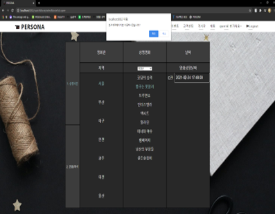
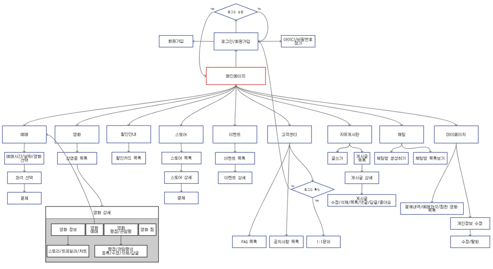

  

## [PERSONA 사이트](https://gyu4.herokuapp.com/)

## [PERSONA 시연영상](https://www.youtube.com/watch?v=O26-Y83OE08)   

## 프로젝트개요
#### PERSONA에서 좌석을 예매하고 음식을 미리 주문하고 PERSONA가 제공하는 이벤트, 제휴카드 등의 서비스를 제공합니다. 또한 소비자들이 자신이 좋아하는 영화를 다른사람들과 공유하고 같은 취향을 가진 사람들과 즐거운 이야기를 나누고 자신이 좋아하는 배우에 대해 공유하고 다가올 상영작에 대해 이야기하는 공간을 서비스해주는 Web 사이트 입니다.

## 프로젝트 주제 선정 배경
#### 펜데믹 시대에 무엇보다 밖에 노출하는 시간을 최대한 짧게 하여야합니다. 하지만 영화를 보고싶어하는 욕구를 없앨 수는 없으니 PERSONA 웹 사이트를 통해 펜데믹상황에 맞는 서비스를 소비자에게 제공해 안전하고 쾌적한 서비스를 소비자에게 제공하고자 PERSONA 프로젝트를 선정하였습니다.

## Target
#### 펜데믹 시대에 최대한 짧게 밖에 있는 시간을 적게 하고 싶으며 영화도 보고싶고 또한 자신이 좋아하는 영화를 다른사람과 공유하고 싶어하는 사람들이 타겟입니다.    

# PERSONA 메인페이지

# 회원가입

# 로그인(아이디찾기, 비밀번호찾기, 카카오로그인)

- 아이디찾기

- 비밀번호 찾기

- 카카오 로그인

# 게시판(목록, 상세보기/댓글쓰기/삭제하기/좋아요, 글쓰기/수정하기)

- 목록

- 상세보기/댓글쓰기/삭제하기/좋아요

- 글쓰기/수정하기

# 영화(목록, 상세보기/좋아요, 댓글쓰기/수정하기/삭제하기)

- 목록

- 상세보기/좋아요

- 댓글쓰기/수정하기/삭제하기

# 예매하기

- 좌석/영화/날짜 예매하기

- 좌석/영화/날짜 예매하기

- 결제하기

# 마이페이지

# 스토어

# 할인카드

# 이벤트

# 고객센터(FAQ, 공지사항, 1:1문의)

# 채팅

# 관리자 기능

- 영화등록

- 예매등록

- 할인카드등록

- 이벤트등록

- 스토어등록

- 회원관리

- 분석차트

# ER Diagram

# 구현 기능

# 테스크 플로우(회원, 관리자)

- 회원

- 관리자

# 사이트 맵

# 사용스킬

# 팀 소개

